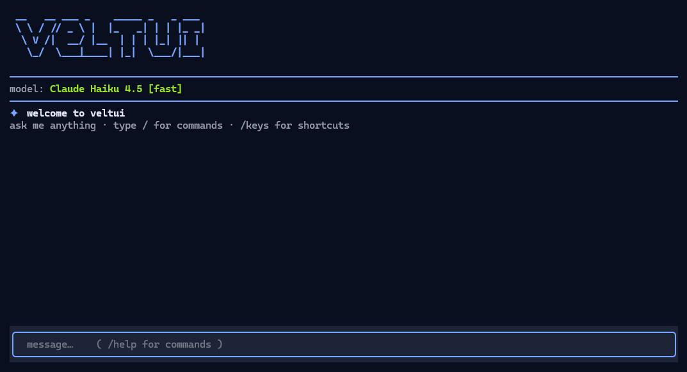
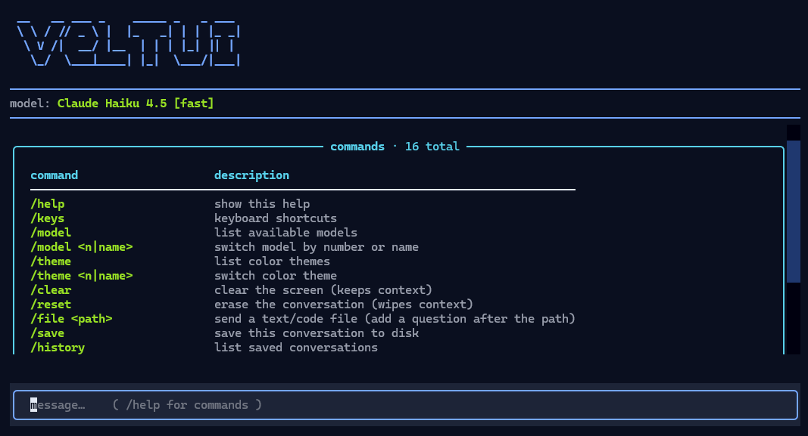

# veltui

Privacy-first AI chat in your terminal, powered by [DuckDuckGo AI Chat](https://duckduckgo.com/aichat).

No account. No API key. No tracking.



## Features

- Multi-turn conversations with context
- Six AI models: GPT-5 Mini, GPT-4o Mini, GPT-OSS 120B, Claude Haiku 4.5, Llama 4 Scout, Mistral Small 4
- Full-screen [Textual](https://textual.textualize.io/) TUI — logo pinned on top, chat scrolls beneath it, input docked at the bottom
- Streaming replies rendered as Markdown
- **8 color themes** — burgundy, slate, midnight, forest, violet, navy, teal, amber (`/theme` or `Ctrl+T` to cycle)
- **Command autocomplete** — type `/` for a live command menu; `Tab` (or `↑`/`↓`) to move through it, and a second menu offers the choices for `/theme` and `/model`
- **Input history** — `↑`/`↓` recall previous messages and commands, like a shell
- **Send files** — `/file <path>` reads a text/code file and sends it (add a question after the path: `/file notes.txt summarize`). `Tab` autocompletes the path like a shell, `Enter` steps into a highlighted folder, and dragging a file onto the terminal (or pasting its path) turns straight into a `/file` command
- **Private by default** — nothing is written to disk unless you `/save`; conversations live only in memory
- Save, load, rename, and delete saved conversations
- Persistent model & theme preference (remembered between sessions)
- `/help` command system (`:help` works too)
- Works on Linux (Arch, etc.) and Windows

## Install

Quick (installs veltui + its deps + the `veltui` command):

```bash
pip install git+https://github.com/kfrttlw/veltui
veltui
```

On the first run veltui downloads its headless Firefox automatically (~80 MB),
so you don't have to. If you'd rather fetch it up front: `playwright install firefox`.

<details>
<summary>From source</summary>

Needs Python 3.10+.

```bash
git clone https://github.com/kfrttlw/veltui
cd veltui
python -m venv .venv

# Linux / macOS
source .venv/bin/activate
# Windows
.venv\Scripts\Activate.ps1

pip install -r requirements.txt
python veltui/veltui.py
```
</details>

## Usage

```bash
veltui
```

With options:

```bash
veltui --help
veltui -m claude          # start with Claude Haiku 4.5
veltui -m 5               # start with model #5 (Llama 4 Scout)
veltui --list-models      # print models and exit
veltui --clear-history    # delete all saved conversations
```

Running from a source checkout instead? `python veltui/veltui.py` takes the same options.

## In-app commands



| command | description |
|---|---|
| `/help` | show all commands |
| `/keys` | keyboard shortcuts |
| `/model` | list models |
| `/model <n\|name>` | switch model |
| `/theme` | list color themes |
| `/theme <n\|name>` | switch theme (or `Ctrl+T` to cycle) |
| `/clear` | clear the screen — keeps context (`Ctrl+L`) |
| `/reset` | erase the conversation — wipes context |
| `/file <path>` | send a text/code file (add a question after the path) |
| `/save [name]` | save conversation to disk |
| `/history` | list saved conversations |
| `/load <n>` | load a saved conversation |
| `/delete <n>` | delete a saved conversation |
| `/delete all` | delete every saved conversation |
| `/rename <n> <name>` | rename a saved conversation |
| `/exit` | quit |

`:help` also works as an alias for `/help`.

## How it works

veltui doesn't call a private API or try to reverse-engineer DuckDuckGo's anti-bot challenge. It launches a headless Firefox (via Playwright), opens [duck.ai](https://duck.ai), and drives the **real** chat UI: it types your message, clicks send, and streams the site's own reply back into the terminal as Markdown. DuckDuckGo's web app does all of its own auth/anti-bot, so veltui stays simple and survives their changes.

That's why the first launch grabs a headless Firefox, and why the very first message takes a moment — the browser is spinning up.

## Privacy

Under the hood veltui runs an ordinary duck.ai session in a **local** headless browser — same privacy as using duck.ai yourself. Per DuckDuckGo's policy it does not tie requests to your identity and does not store chats, and because requests are proxied the underlying model provider never sees your IP. Everything is over HTTPS.

**Private by default:** nothing is written to disk while you chat — the conversation lives only in memory and is gone when you quit. Only `/save` persists a conversation, stored locally at `~/.veltui/db.sqlite`. That file is plain, unencrypted SQLite, so anyone with access to it can read saved chats — don't save anything you'd be hurt to leak from your own machine. The only thing saved automatically is your model & theme preference.

## Models

| # | name | id | provider |
|---|---|---|---|
| 1 | GPT-5 Mini | `gpt-5-mini` | OpenAI via DDG |
| 2 | GPT-4o Mini | `gpt-4o-mini` | OpenAI via DDG |
| 3 | GPT-OSS 120B | `tinfoil/gpt-oss-120b` | OpenAI (open weights) via DDG |
| 4 | Claude Haiku 4.5 | `claude-haiku-4-5` | Anthropic via DDG |
| 5 | Llama 4 Scout | `meta-llama/Llama-4-Scout-17B-16E-Instruct` | Meta via DDG |
| 6 | Mistral Small 4 | `mistral-small-2603` | Mistral via DDG |

## Notes

- **Context lives in the live session.** Because veltui drives the real duck.ai chat, the conversation context is held by duck.ai for as long as the app is open. `/load` re-shows a saved conversation, but duck.ai only "remembers" what's actually been typed in the current run.
- **Switching model starts a fresh chat** — that's how duck.ai's picker works, so a `/model` switch mid-conversation drops the running context.
- **Occasional throttling.** duck.ai may briefly rate-limit very rapid bursts; veltui backs off and retries once, then tells you plainly if it's still blocked (waiting a bit or switching network clears it).

## Disclaimer

veltui is an unofficial, personal/educational project and is **not affiliated with, endorsed by, or supported by DuckDuckGo**. It automates the public duck.ai web interface in a local browser — please use it responsibly and don't hammer the service. If you depend on duck.ai, read DuckDuckGo's own terms too.

## License

[MIT](LICENSE) © kfrt
