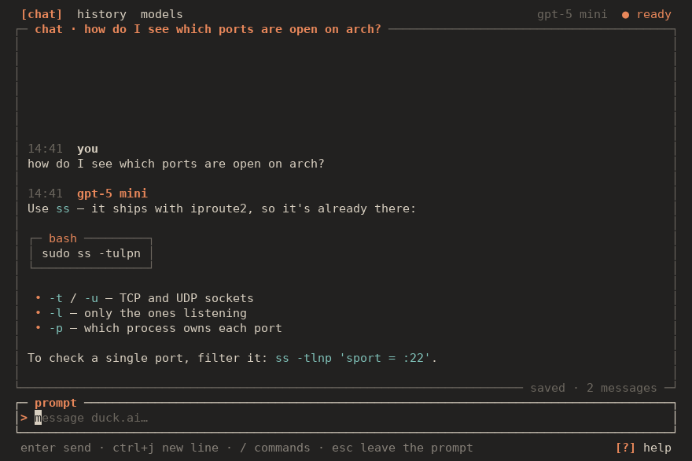
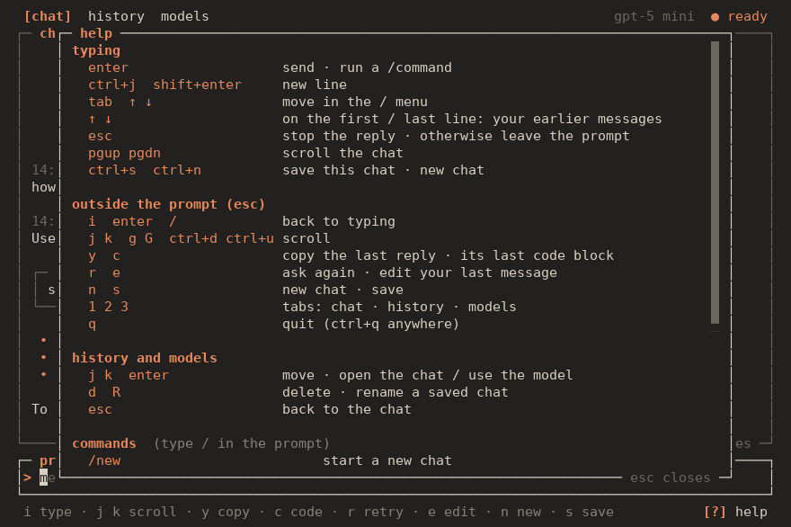

# veltui

[duck.ai](https://duck.ai) in your terminal: private AI chat, no account, no API key.



- **Six models:** GPT-5 Mini, GPT-4o Mini, GPT-OSS 120B, Claude Haiku 4.5, Llama 4 Scout, Mistral Small 4.
- **Replies stream in as Markdown,** with code in square frames and your terminal's own colours (no themes: veltui uses your palette and a transparent background).
- **The browser starts while you type,** so the first answer isn't slow. A `● ready` indicator in the corner shows it's connected.
- **When you're not chatting, Firefox sleeps:** after 10 idle minutes it's closed and gives its memory back, then wakes up as you type.
- **You stay in control of a reply:** `esc` stops it, `r` asks again, and `e` edits your last question.
- **Real multi-line input:** paste code or a stack trace, and every line arrives. `ctrl+j` adds a new line.
- **Files:**
  - Paste or drop a file's path into the prompt to attach it, then ask about it.
  - Or type `/file path question`. `tab` completes paths, even ones with spaces.
- **Copying:** `y` copies the last reply and `c` copies its last code block. Both use the terminal clipboard (OSC 52) and `wl-copy`/`xclip`.
- **Tabs:**
  - **history** for your saved chats: open, rename, or delete them.
  - **models** for switching models.
- **Nothing on disk unless you save:** `ctrl+s` keeps a chat, and from then on it saves itself.
- **`veltui doctor`:** when duck.ai changes its site, this shows exactly what broke.

## Install

```bash
pip install git+https://github.com/kfrttlw/veltui
veltui
```

veltui needs Python 3.10+. On the first run it downloads Playwright's Firefox (~90 MB, once). To get it up front, run `playwright install firefox`.

## Keys

| typing | |
|---|---|
| `enter` | send · run a `/command` |
| `ctrl+j` `shift+enter` | new line |
| `tab` `↑` `↓` | move in the `/` menu |
| `↑` `↓` on the first / last line | your earlier messages |
| `esc` | stop the reply, otherwise leave the prompt |
| `pgup` `pgdn` | scroll the chat |
| `ctrl+s` `ctrl+n` | save this chat · new chat |

| outside the prompt (after `esc`) | |
|---|---|
| `i` `enter` `/` | back to typing |
| `j` `k` `g` `G` `ctrl+d` `ctrl+u` | scroll |
| `y` `c` | copy the last reply · its last code block |
| `r` `e` | ask again · edit your last message |
| `n` `s` | new chat · save |
| `1` `2` `3` | tabs: chat · history · models |
| `?` `f1` | help |
| `q` `ctrl+q` | quit |

In **history**: `enter` opens a chat, `d` deletes it, and `R` renames it.

## Commands

Type `/` in the prompt. A menu opens, and `tab` completes.



| command | |
|---|---|
| `/new` | start a new chat |
| `/model [name\|n]` | switch model; with no name it opens the models tab |
| `/file <path> [question]` | send a text file, optionally with a question |
| `/save [title]` | save this chat; from then on it saves itself |
| `/rename <title>` | rename this chat |
| `/history` | saved chats |
| `/export [path]` | write this chat to a Markdown file |
| `/copy [code]` | copy the last reply, or its last code block |
| `/retry` | ask the last question again |
| `/help` | keys and commands |
| `/quit` | exit |

From the shell:

```bash
veltui -m claude          # start with Claude Haiku 4.5
veltui -m 5               # start with model #5 (Llama 4 Scout)
veltui --list-models
veltui --clear-history    # delete every saved chat
veltui --idle 30          # keep Firefox around for 30 idle minutes (0 = always)
veltui --show-browser     # watch Firefox do it, for debugging
veltui doctor --send      # check duck.ai's page, send one test message
```

## How it works

duck.ai guards its chat with an anti-bot check that veltui doesn't try to imitate. Instead veltui runs a headless Firefox (through Playwright) with the real duck.ai open. It types your message into the page's own box and clicks the page's own buttons. It also reads the reply off the page's own network stream. duck.ai does all of its own checks, so veltui stays simple.

**Context:**
- The conversation you see is veltui's own copy.
- Sometimes duck.ai's chat can't match it:
  - after you open a saved chat or switch models (switching starts a new duck.ai chat);
  - after an error, or if Firefox died and was restarted.
- In those cases your next message carries the conversation so far, so the model keeps the thread. A note in the chat says when that happens.

**Load:**
- Firefox is the heavy part, about 415 MB while it runs.
- After 10 minutes without a message veltui closes it, which gives all of that memory back. It starts again as soon as you type, and the conversation carries over (`--idle MIN` changes the wait, `--idle 0` keeps Firefox running).
- veltui itself takes about 47 MB. Idle it uses no CPU at all: the prompt cursor doesn't blink, and nothing redraws until something changes.

## When duck.ai changes

Sooner or later duck.ai renames a button and veltui stops working. Then run:

```bash
veltui doctor --send
```

It checks every part of the page veltui relies on (the message box, the buttons, the model picker), sends one test message, and saves a report with a screenshot to `~/.cache/veltui/doctor-…/`. The report says exactly which piece moved, and the fix is usually one line in `veltui/duck.py` (all the labels are at the top).

## Privacy

veltui runs an ordinary duck.ai session in a **local** browser, which is as private as using duck.ai yourself. Per DuckDuckGo, chats aren't tied to you or stored. Requests are proxied, so the model provider doesn't see your IP.

**Nothing is written to disk until you save a chat.** Two things live in `~/.local/share/veltui/veltui.db`: the chats you save and the model you last picked. The folder is readable only by you (0700/0600), but the database isn't encrypted. Firefox's disk cache is off.

Coming from veltui 0.1? Your saved chats are copied over from `~/.veltui` on the first start. The old folder is left alone; delete it when you're happy.

## Models

| # | name | id | |
|---|---|---|---|
| 1 | GPT-5 Mini | `gpt-5-mini` | think |
| 2 | GPT-4o Mini | `gpt-4o-mini` | fast |
| 3 | GPT-OSS 120B | `tinfoil/gpt-oss-120b` | think |
| 4 | Claude Haiku 4.5 | `claude-haiku-4-5` | fast |
| 5 | Llama 4 Scout | `meta-llama/Llama-4-Scout-17B-16E-Instruct` | fast |
| 6 | Mistral Small 4 | `mistral-small-2603` | fast |

Each reply is labelled with the model duck.ai *actually* used (read from its request). If a switch didn't take, veltui tells you.

## Development

```bash
pip install -e '.[dev]'
pytest
```

- `tests/test_logic.py` and `tests/test_app.py` run anywhere; the app runs headless with a fake duck.ai thread.
- `tests/test_duck.py` drives the real Firefox against `tests/fakeduck.py`, a local stand-in for duck.ai with the same buttons and stream. It's skipped when Playwright's Firefox can't start.

## Disclaimer

veltui is an unofficial personal project. It isn't affiliated with, endorsed by, or supported by DuckDuckGo. It automates the public duck.ai page in a local browser, so please don't hammer the service, and read DuckDuckGo's terms if you depend on it.

## License

[MIT](LICENSE) © kfrt
